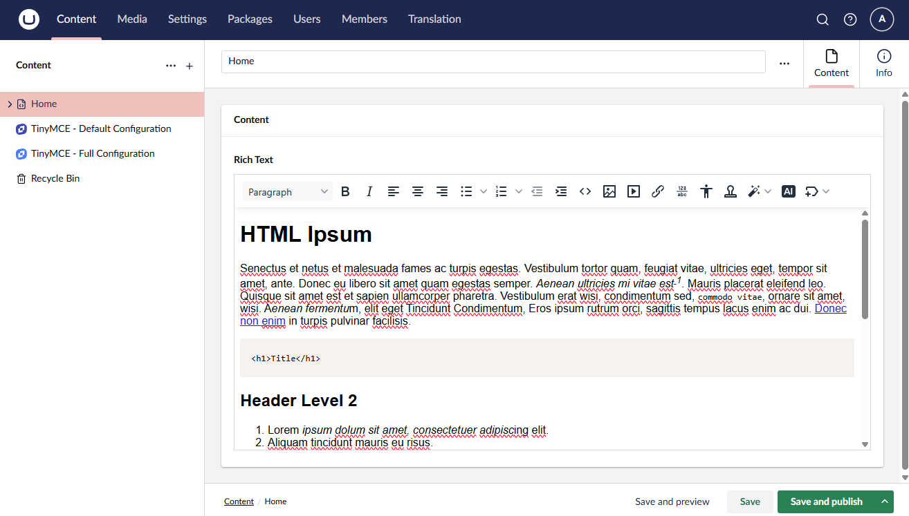
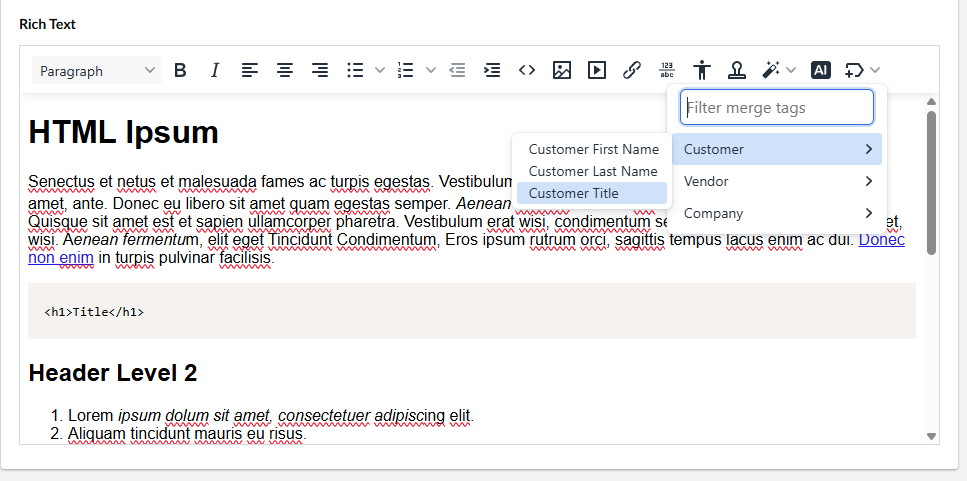
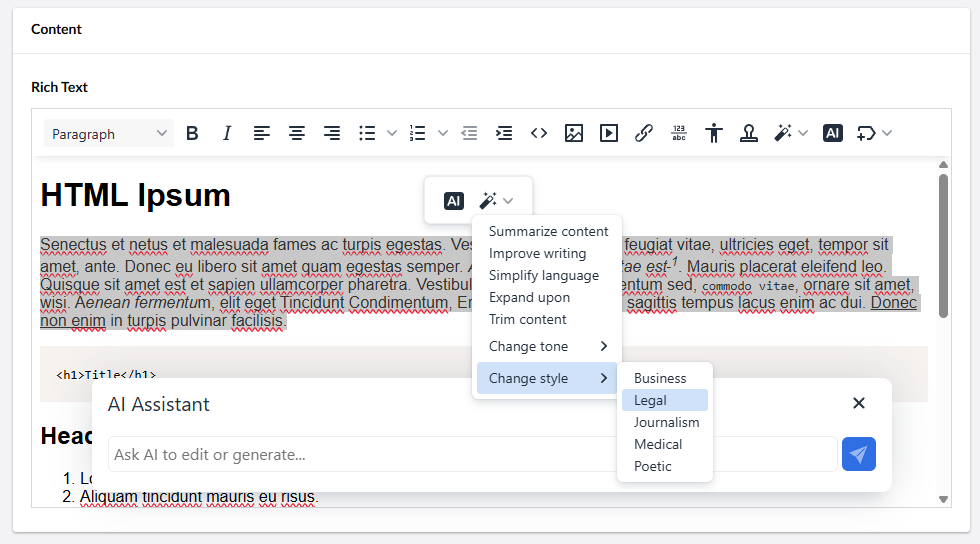

## TinyMCE for Umbraco CMS

[](https://www.nuget.org/packages/TinyMCE.Umbraco/)
[](https://www.nuget.org/packages/TinyMCE.Umbraco)
[](../LICENSE)

This package brings the [TinyMCE](https://www.tiny.cloud/) Rich Text Editor (RTE) back to [Umbraco CMS](https://umbraco.com/), (version 16+).

It also supports the use of TinyMCE Premium plugins with a valid subscription. Additional features include streamlined configuration for RTE Data Types in Umbraco and enhanced settings that support direct JSON-based configuration via .NET (`appsettings.json`).



If you would like to update TinyMCE to version 7 or 8, please read the "Updating TinyMCE To Version 7 or 8" section below.

## Releases

Available via the [Releases page](https://github.com/ProWorksCorporation/TinyMCE-Umbraco/releases)


### Installation

To [install from NuGet](https://www.nuget.org/packages/TinyMCE.Umbraco), you can run the following command from the `dotnet` CLI:

    dotnet add package TinyMCE.Umbraco

In addition, you can install packages via the Visual Studio NuGet Package Manager.  This can be found in the Tools menu of Visual Studio.

### Upgrading from v15

If you are upgrading from Umbraco version 15, install this package before beginning the migration / upgrade process to version 16.  If installed before the upgrade migration, this package will prevent the conversion to the TipTap editor and keep the TinyMCE RTE in place.

### Looking for the v13 version?

You can find the v13 version on [NuGet as TinyMCE.Umbraco.Premium](https://www.nuget.org/packages/tinymce.umbraco.premium/).  Also, the documentation is available as a Readme on the [v13/main branch here on Github](https://github.com/ProWorksCorporation/TinyMCE-Umbraco/tree/v13/main).

# Documentation

To get started with the TinyMCE Umbraco property editor and use it with your projects, you will need to add some basic configuration and need to create a new Data Type for the TinyMCE Rich Text Editor.  See the ["Usage / Setup"](#usage--setup) Section below for more information.

## Configuration

The following options are available for configuration in the `appsettings.json` or through other environment level configuration settings (`web.config`, Azure environment variables, etc).  This is using standard .NET configuration and you can learn more about [.NET Configuration here](https://learn.microsoft.com/en-us/aspnet/core/fundamentals/configuration/?view=aspnetcore-8.0).

### Umbraco CMS RichTextEditor configuration retained

The traditional Umbraco CMS TinyMCE Configuration settings continue to function as expected.  The Umbraco Documentation has a good example of the configuration options and how they can be set here: [Rich text editor settings](https://docs.umbraco.com/umbraco-cms/13.latest/reference/configuration/richtexteditorsettings).

```json
{
	"Umbraco": {
		"CMS": {
			"RichTextEditor": {
				"Commands": "RichTextEditorCommand ARRAY"
				"Plugins": ["STRING ARRAY"],
				"CloudApiKey": "STRING",
				"ValidElements": "STRING",
				"InvalidElements": "STRING",
				"CustomConfig": {JSON KEY/VALUES}
			}
		}
	}
}
```

The details on each configuration value are described below:

| Setting     | Values      |Default  | Note |
| ----------- | ----------- |---------|------|
| Commands   | RichTextEditorCommand  | None    | A list of RichTextEditorCommand objects that contain and alias (STRING), name (STRING), and mode ("Insert", "Selection", or "All"). These commands are the buttons you find at the top of the editor, such as bold, italic, and so on. |
| Plugins  | String array of TinyMCE plugins names to include  | None   | Add plugins to the list of available plugins in the TinyMCE Rich Text Editor DataType. See the [Tiny Documentation](https://www.tiny.cloud/docs/tinymce/6/plugins/) for a list of plugins. |
| CloudApiKey      | key string  | None    | The TinyMCE API Key found in [your account](https://www.tiny.cloud/my-account/integrate/#html). If applied, this will load the TinyMCE library from the Tiny Cloud URL unless the "tinyMceUrl" is specified. |
| ValidElements | string |  [See defaults](../docs/defaults.md) | Specifies the list of HTML tags available to the TinyMCE Rich Text Editor. See the [default list of ValidElements](../docs/defaults.md) for more information. |
| InvalidElements | String | None | Specifies invalid HTML tags. These tags will not be allowed. |
| CustomConfig | JSON key/value pairs | {} | Simple key/value pairs for configuration of the TinyMCE Editor and Plugins. See the [Tiny Documentation](https://www.tiny.cloud/docs/tinymce/6/plugins/) for the plugin configuration. This is here to support easy migration and upgrades. **It is recommended to use the customConfig element below for a richer configuration experience.** | 


### New Configuration Options:

This package adds addition enhanced configuration options that carry over from the v13 TinyMCE Umbraco Premium package:

```json
{
	"TinyMceConfig": {
		"tinyMceUrl": "STRING",
		"tinyMceVersion": "STRING"
		"apikey": "STRING",
		"openAiApikey": "STRING",
		"pluginsToExclude": ["STRING ARRAY"],
		"openAiApiConfig": {
			"model": "STRING",
			"developerMessage": "STRING",
			"maxCompletionTokens":  NUMBER,
			"temperature": NUMBER
		}
		"customConfig": {JSON}
	}
}
```

The details on each configuration value are described below:

| Setting     | Values      |Default  | Note |
| ----------- | ----------- |---------|------|
| tinyMceUrl  | url string  | None    | The URL location of the TinyMCE library. This allows for specific cloud URL access or self-hosted options. |
| tinyMceVersion  | string  | 6    | The version of the TinyMCE library. |
| apikey      | key string  | None    | The TinyMCE API Key found in [your account](https://www.tiny.cloud/my-account/integrate/#html). If applied, this will load the TinyMCE library from the Tiny Cloud URL unless the "tinyMceUrl" is specified. |
| openAiApikey | key string | None    | The ChatGPT API Key found in [your account](https://platform.openai.com/api-keys). This will enable a default implementation of the AI functionality using ChatGPT. |
| pluginsToExclude | String array of TinyMCE plugins names to exclude | [] | This excludes these plugins from being selected or used by the TinyMCE Rich Text Editor |
| openAiApiConfig | Configuration for the OpenAI API | SEE BELOW | This configuration allows for the selection of the OpenAI model and other API configuration. See [OpenAI documentation](https://platform.openai.com/docs/api-reference/chat/create) for more details on the settings. |
| customConfig | JSON TinyMCE Configuration | {} | See the [Tiny Documentation](https://www.tiny.cloud/docs/tinymce/6/plugins/) for the plugin configuration. **NOTE:** this is JSON and can contain nested elements unlike the key/values in the RichTextEditor configuration above. | 

The **openAiApiConfig** supported configuration properties are described below:
| Setting     | Values      |Default  | Note |
| ----------- | ----------- |---------|------|
| model  | string  | "gpt-5"    | Name of the OpenAI model to use.  See the [OpenAI Model Guide](https://platform.openai.com/docs/models) for more information on each model. |
| developerMessage  | string  | ""    | Developer-provided instructions that the model should follow, regardless of messages sent by the user. |
| maxCompletionTokens  | number  | 800    | An upper bound for the number of tokens that can be generated for a completion, including visible output tokens and reasoning tokens. |
| temperature  | number  | 1.0    | What sampling temperature to use, between 0 and 2. Higher values like 0.8 will make the output more random, while lower values like 0.2 will make it more focused and deterministic. NOTE: gpt-5 doesn't support customization of temperature. |

## Data Types

### Rich Text Editor

#### Open Source Plugins

The following open source TinyMCE plugins are available to add to the TinyMCE Umbraco RTE editor tools via the DataType configuration:

* Accordion (accordion)
* Code Sample (codesample)
* Emoticons (emoticons)
* Help for Editors (help)
* Insert Date/Time (insertdatetime)
* Search and Replace (searchreplace)
* Word Count (wordcount)

#### Premium Plugins

If the `appsettings.json` configuration has a valid Tiny apiKey set in configuration, then the following additional packages are available to the TinyMCe Umbraco Rich Text Editor:

* Accessibility Checker (a11ychecker)
* Advanced Typography (typography)
* Case Change (casechange)
* Checklist (checklist)
* Export (export)
* Footnotes (footnotes)
* Format Painter (formatpainter)
* Merge Tags (mergetags)
* Page Embed (pageembed)
* Permanent Pen (permanentpen)
* Spell Checker Pro (tinymcespellchecker)
* Table of Contents (tableofcontents)

Most of these have a Command / Toolbar associated with them and are disabled by default.  To enable them, go to the Data Type in the Settings section of Umbraco to edit the toolbars available.



#### Additional Premium Plugins

This package can be used to access some of the additional TinyMCE packages that may require more configuration to be used effectively.  

In addition to the packages listed above, below are the additions TinyMCE Packages that are available via the TinyMCE Rich Text Editor:

* Advanced Code Editor (advcode)
* Advanced Table Editor (advtable)
* Advanced Templates (advtemplate)
* AI Assistant Shortcuts (ai)
* Enhanced Media Embed (mediaembed)
* Link Checker (linkchecker)
* PowerPaste (powerpaste)
* Spelling Autocorrect (autocorrect)



### Usage / Setup
In order to use the TinyMCE Rich Text Editor, you will need to create at least one Umbraco Data Type that uses this property editor.  Learn more about Umbraco Data Types and how to create them in the [Umbraco Documentation here](https://docs.umbraco.com/umbraco-cms/fundamentals/data/data-types).

#### Additional Features

The TinyMCE Rich Text property editor adds a few new configuration options (from the v15 Umbraco TinyMCE Property Editor) for each Data Type that you create:

1. Plugin Selection: Similar to the Toolbar items, you can select which plugins are enabled / available for this Data Type via the back-office UI.
2. CustomConfig: Each Data Type that implements this editor has its own TinyMCE Configuration JSON that can be used for a custom configuration specific to this Data Type.

Both of these Data Type configuration options are managed via the Data Type editing interface in the back-office of Umbraco.

## Extending the Rich Text Editor

If you would like to extend the TinyMCE for Umbraco CMS package, there is an [npm package](https://www.npmjs.com/package/@tiny-mce-umbraco/backoffice) avaliable to allow extentions and customization.  It can be installed for development by running this on the command line:

    npm install --save-dev @tiny-mce-umbraco/backoffice

Creating an extension to this package aligns with how [Umbraco CMS allowed custom package in version 15](https://docs.umbraco.com/umbraco-cms/fundamentals/backoffice/property-editors/built-in-umbraco-property-editors/rich-text-editor-tinymce/plugins).  

The main difference is that the imports need to be from the @tiny-mce-umbraco/backoffice package reference like so:

	import { UmbTinyMcePluginBase } from '@tiny-mce-umbraco/backoffice/core';
	import type { TinyMcePluginArguments } from '@tiny-mce-umbraco/backoffice/core';
	import type { Editor } from '@tiny-mce-umbraco/backoffice/external/tinymce';

## Updating TinyMCE To Version 7 or 8

The TinyMCE.Umbraco package allows for changing out the TinyMCE that is loaded by the package to a newer open source version, newer TinyMCE Cloud version, or a licensed on-premise installation.

For more information read the guides appropriate to your situation:

 - [Install Open Source GPLv2+ versions of TinyMCE](/docs/README_opensource_onpremise.md)
 - [Install Licensed on-premise versions of TinyMCE](/docs/README_onpremises.md)
 - [Reference Cloud CDN versions of TinyMCE](/docs/README_cloud_cdn.md)


# Support and More

If you have questions about TinyMCE plugins, please contact TinyMCE Support directly.

If something specific to the Property Editors in this package or the Configuration isn't working as you would expect, please submit a question via the [GitHub Issues](https://github.com/ProWorksCorporation/TinyMCE-Umbraco/issues) for this project.  We will do our best to monitor and respond, but please be patient with us.

In addition, you may find that the community is very helpful and you can ask questions of them on the [Umbraco Forums](https://forum.umbraco.com/) or the [Umbraco Discord Server](https://community.umbraco.com/get-involved/community-discord-server/).


## Contributing

Contributions to this package are most welcome! Please read the [contributing guidelines](CONTRIBUTING.md).


## License

Copyright &copy; [ProWorks Corporation](https://proworks.com).

All source code is licensed under the [MIT License](../LICENSE).

The initial source code has been derived from [Umbraco CMS](https://github.com/umbraco/Umbraco-CMS), originally licensed under the MIT License.


## Acknowledgments

Thanks to [TinyMCE](https://www.tiny.cloud/) and [Umbraco](https://umbraco.com/) for their support during the package development.

Special thanks to [Lee Kelleher](https://github.com/leekelleher) and [Jacob Overgaard](https://github.com/iOvergaard) for their contributions, help getting started, and for giving valuable feedback along the way.

Also thanks to the [ProWorks](https://www.proworks.com) team for their encouragement, support, and contributions.
